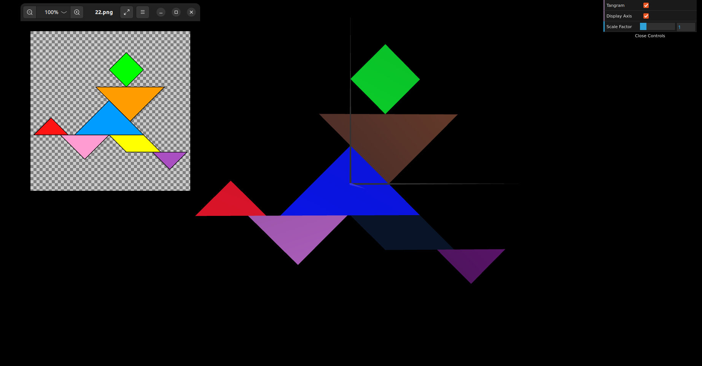
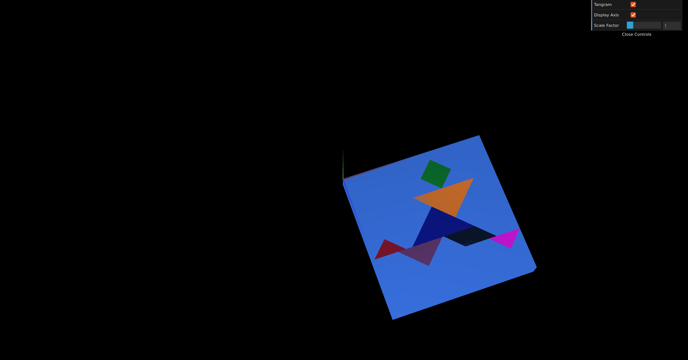
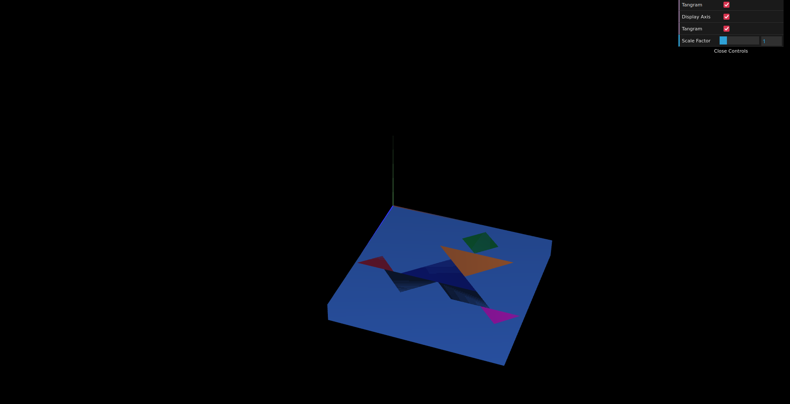

# CG 2023/2024

## Group T12G12

## TP 2 Notes

- In exercise 1 we combined the figures we created in the previous lesson to form a Tangram. To accomplish that, we applied geometrical transformations to arrange the figures to resemble the given tangram shape (figure 22). Additionally, we created a checkbox that allows us to control the tangram's visibility.

**Figure 1:** Tangram

- In exercise 2 we created a unit cube and positioned it behind the tangram created in the previous exercise, serving as a base. The entire image, consisting of the unit cube and the tangram, was centered on the origin (0, 0, 0) of the reference system. It was also oriented parallel to the xz plane.
    

**Figure 2:** Tangram and Unit Cube

- In exercise 3 we build another unit cube, this time using a square plane as the base, which in turn consists of two triangles.

**Figure 3:** Tangram and Unit Cube Quad
