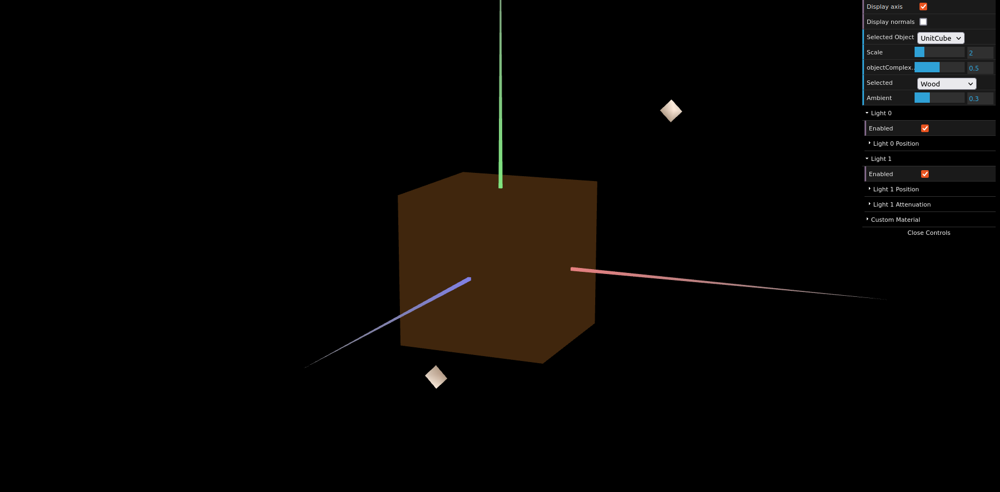
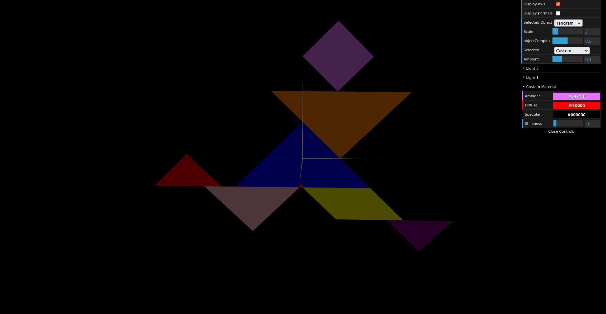
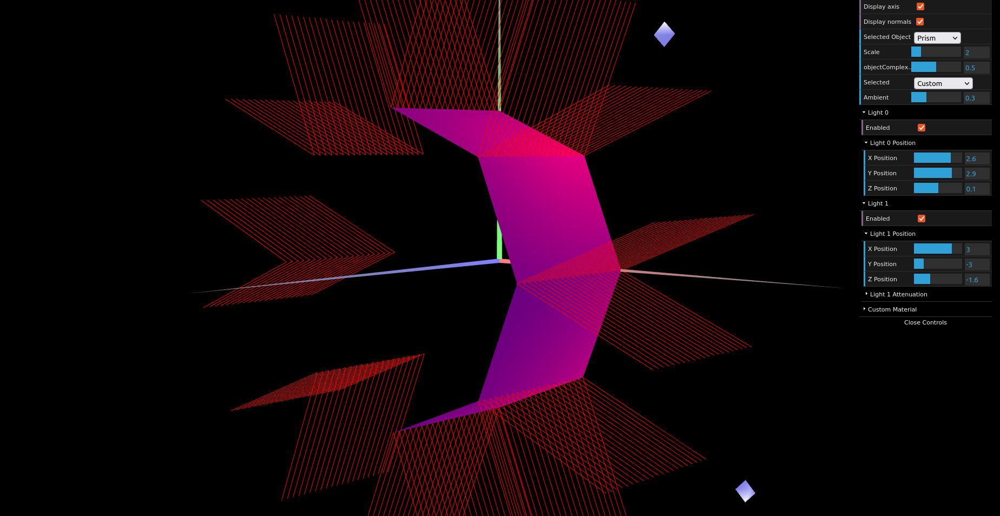
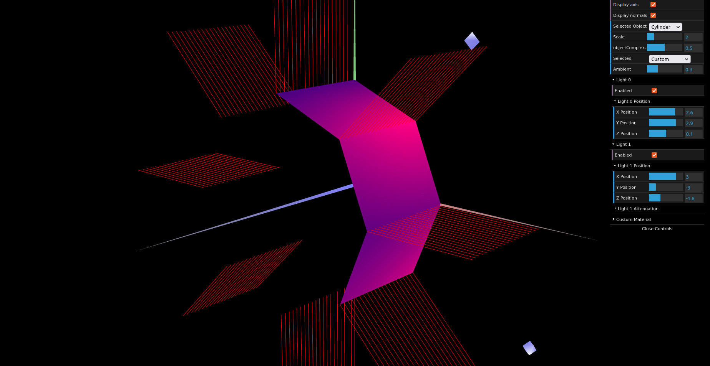

# CG 2023/2024

## Group T12G12

## TP 3 Notes

### Exercise 1

With the figures generated in previous lessons, we expanded the existing list by adding new objects. Upon inspection, we noticed that these objects lacked defined normals, so we proceeded to declare them accordingly. Additionally, we introduced a new material called 'Wood,' designed to mimic the appearance of wood with a color resembling that of natural wood and a reduced specular component. We tested this material by applying it to the cube.

**Figure 1:** Cube

Finally, we assigned a material to each part of the tangram, configuring them with a high specular component. Specifically, we applied the 'Custom' material to the diamond, which serves as a subpart of the tangram.

**Figure 2:** Tangram

### Exercise 2

In this exercise, we created a prism with a flexible number of vertices and stacks. In the prism created, since the normals are the same for each surface, the lighting of each face remains constant. This means that regardless of the position of the observer or the light source, the color of each face remains the same, resembling the behavior of "Constant Shading".

**Figure 3:** Prism

### Exercise 3

Finally, we constructed a cylinder derived from the prism. To achieve this, we adjusted the normals to be perpendicular to the ideal cylinder in which the original prism is inscribed. This allowed for fewer normals and vertices to be calculated, resulting in smoother lighting transitions between surfaces, as anticipated.

**Figure 4:** Cylinder
