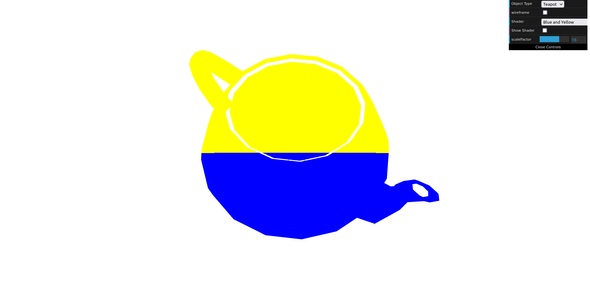
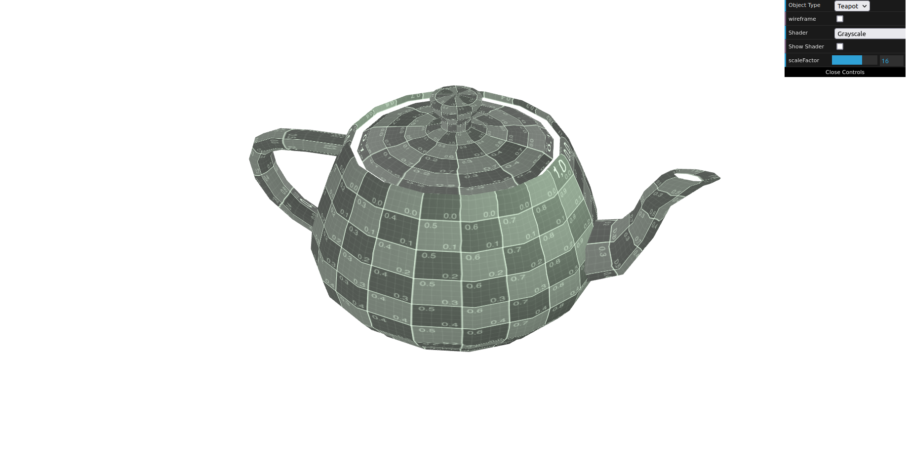
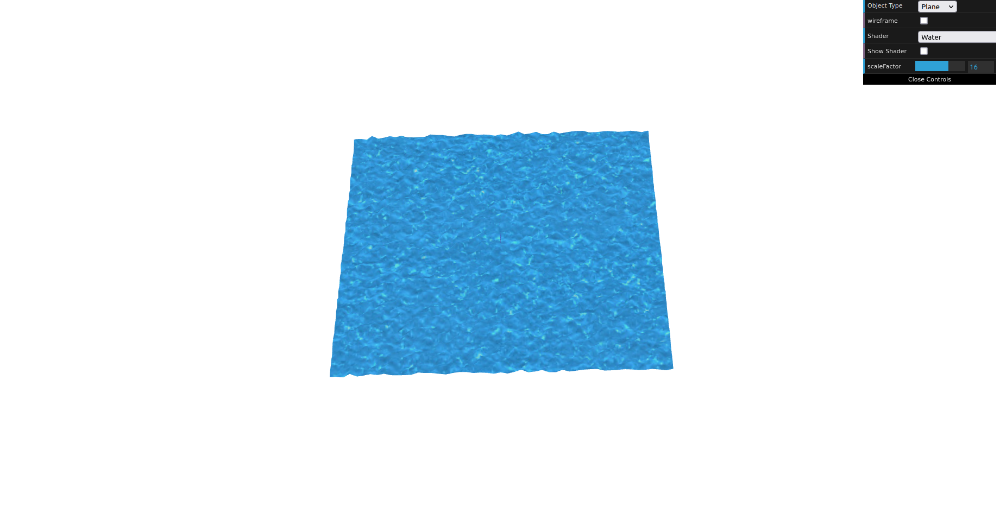

# CG 2023/2024

## Group T12G12

## TP 5 Notes

### Exercise 1
In the first part of the exercise, we split the teapot into two colors by creating a new fragment and vertex. The section of the teapot above the line y = 5 was colored yellow, while the portion below was colored blue.

**Figure 1:** Teapot with two colors

Next, we implemented a movement on the teapot following a sine wave on the x-axis. Finally, we introduced a new fragment based on the sepia fragment, where we converted the colors to grayscale.

**Figure 2:** Teapot with colors in Grayscale

### Exercise 2

In the initial step, we introduced a new vertex shader named "water" and a corresponding fragment shader called "water" based on the existing texture2 fragment and vertex shaders. Subsequently, we updated the textures in the scene to "waterTex" and "waterMap." Afterwards, we modified the vertex shader to accommodate the color components of the texture. Finally, we implemented texture coordinate animation based on time.

**Figure 3:** Water animation

